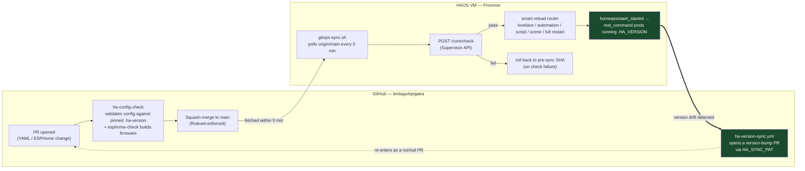

<!-- Lentago Labs brand header — generated by lentago/.github → brand/generate.py.
     Regenerate there; do not hand-edit the banner or badge URLs. -->
<a href="https://lentago.dev"></a>

[](https://github.com/lentago/epigaea/actions) [](https://github.com/lentago/epigaea/blob/main/LICENSE)

  

# epigaea

**Epigaea** (trailing arbutus, mayflower — the Massachusetts state flower,
a low evergreen native that blooms at the edge of winter) is the Lentago
Labs physical-world telemetry practice: a production smart home run as
declarative YAML, and the base for the cold-chain and facilities offering.
Renamed from `homeassistant-config` on 2026-08-17
([lentago/.github#116](https://github.com/lentago/.github/issues/116)) —
it graduated into the fleet's botanical codename tier because it stopped
being a config dump and became a product line.

**Authorship:** The YAML configuration, ESPHome firmware, automations, dashboards, scripts, and documentation in this repo are co-written with [Claude](https://claude.ai) (Anthropic). I direct the work and review the output; Claude writes the code. I'm an infrastructure operator, not a software engineer — please don't read this repo as a portfolio of coding ability.

Git-controlled Home Assistant deployment running on Proxmox. 146 controllable entities managed as declarative YAML — git-tracked config is never edited in the admin console (one deliberate exception: root `automations.yaml` is UI-authored — see the [Config Governance table](#config-governance)), and there is no issue queue for change dispatch. The merged PR is the change record; a GitOps poller applies it to the running HAOS VM within 5 minutes.

## 🔁 The GitOps loop

This repo's most distinctive pattern isn't the deploy half of the loop — most
GitOps setups pull config onto a runtime. It's that the runtime **reports its
own version back**, closing the loop from the other direction so drift is
caught whichever way it happens:



**Left (GitHub):** a PR lands, `ha-config-check` validates it against the
exact HA version pinned in [`.ha-version`](.ha-version) and `esphome-check`
builds the two panels' firmware, then it squash-merges. **Right (the HAOS
VM):** `scripts/gitops-sync.sh` polls every 5 minutes, pulls the merged
commits, validates via the Supervisor API, and
routes to the lightest reload the change actually needs — never a blind
`core.restart`. **The closing leg (heavy arrow):** on every startup the VM
posts its own `.HA_VERSION` back to GitHub; if it disagrees with the pin, the
[`ha-version-sync.yml`](.github/workflows/ha-version-sync.yml) workflow opens
a version-bump PR that re-enters Card 1 like any other change. Drift is
caught from both directions — a bad config PR is rejected before it reaches
the VM, and a VM that drifts from the pin (a manual HA update, a reflash)
corrects the git record instead of silently diverging from it.

## 🧭 What this repo demonstrates

A production smart home run as declarative YAML — real CI gates, event-driven apply-on-merge to a physical VM, and a self-reporting device that files its own version-bump PRs.

| Pattern | How it shows up here |
|---|---|
| Real HA validator in CI, not just a linter | [`.github/workflows/ha-config-check.yml`](.github/workflows/ha-config-check.yml) spins up the exact pinned HA Docker image on every PR and runs `check_config` — schema errors and bad `!include` paths caught before merge, not at runtime |
| Apply-on-merge to a physical device | [`scripts/gitops-sync.sh`](scripts/gitops-sync.sh) polls `origin/main` every 5 minutes, validates via the Supervisor API, and smart-reloads; auto-rolls back to the pre-sync SHA with a mobile alert on failure |
| Merge blocked mechanically, not socially | Required status checks (`check-config`, `docs-check`) are enforced by a branch Ruleset — squash-only; the PR cannot land until validation passes |
| Self-reporting device closes its own drift loop | HAOS fires `homeassistant_started` → `rest_command` POSTs to GitHub → [`ha-version-sync.yml`](.github/workflows/ha-version-sync.yml) compares, branches, and opens+auto-merges a version-bump PR — the running system is its own maintenance agent |
| PAT-over-GITHUB_TOKEN — documented, not just used | The [HA_SYNC_PAT rationale](#why-ha_sync_pat-instead-of-github_token) explains why the default token can't trigger downstream workflows or push past branch protection — a gotcha every GitOps practitioner hits |
| Governance partition prevents bidirectional sync conflicts | The [Config Governance table](#config-governance) partitions `automations.yaml` (UI-authored) from `automations/` (git-authored, PR-only) — without this split, a `git reset --hard` would silently clobber UI edits |
| Fake-secrets for full CI without real credentials | [`secrets.fake.yaml`](secrets.fake.yaml) is copied to `secrets.yaml` in CI so `!secret` references resolve without exposing real values — full config validation on every PR |
| PR dispatch with no issue-tracker step | Changes are dispatched by talking to Claude Code directly; the PR is the canonical record of intent — a deliberate deviation from the fleet norm that reduces round-trips |

## 🛠️ Make a change yourself

These systems are real, and nothing critical rides on them. That makes this a
safe place to try a change before you make the same kind of change in your own
shop. Pick one:

**Add or modify a git-managed automation**

Write or edit a YAML file under [`automations/`](automations/) — that directory is the git-authored, PR-only side of the [governance partition](#config-governance). (`automations.yaml` at the repo root is UI-authored and must never be git-edited — the GitOps `git reset --hard` would clobber any UI changes to it on next sync.) Open a PR directly; no issue step is required in this repo — the PR is the record. Required status checks gate merge: `check-config` (runs Home Assistant's actual config validator against the pinned `.ha-version`) and `docs-check` (runs on all PRs, not path-filtered). Squash-merge is the only allowed method. After merge, the GitOps poller fetches `origin/main` within 5 minutes, validates via the Supervisor API, and smart-reloads. If validation fails, it auto-rolls back to the pre-sync SHA and sends a mobile notification — HA is never left in a broken state.

**Proof this works:**
- [#384 — Add basement water leak detection automation](https://github.com/lentago/epigaea/pull/384) — new file under `automations/`
- [#391 — Expand outdoor light schedule to all outdoor lights, off at 9:30 PM](https://github.com/lentago/epigaea/pull/391) — edits an existing `automations/` file
- [#495 — fix(alarm): drop the dead basement-kitchen door from House Openings](https://github.com/lentago/epigaea/pull/495) — config-level fix, same deploy path

**Observe the self-reporting version loop**

HAOS fires `homeassistant_started` on every startup; a `rest_command` in [`packages/ha_version_sync.yaml`](packages/ha_version_sync.yaml) dispatches `ha-version-report` to GitHub. The [`ha-version-sync.yml`](.github/workflows/ha-version-sync.yml) workflow validates the payload, compares the running version to the pin in `.ha-version`, and — on drift — creates a branch, bumps the pin, and opens a PR via `HA_SYNC_PAT`. Once `check-config` passes, the PR auto-merges. The device filed its own maintenance PR with no human prompt.

Org membership is not required to read or fork this repo. PRs from a fork follow the standard GitHub flow; required checks still gate merge.

## What's Here

**A complete smart home platform** managing 146 controllable entities (lights, switches, covers, climate, media players, locks, and the alarm panel) within a 1,415-entry HA entity registry — across lighting (Hue, Kasa), security (Konnected alarm panels with custom ESPHome firmware), media (Sonos whole-home audio), and environmental monitoring (weather, door/motion sensors) — all surfaced through two purpose-built dashboards.

**A custom alarm system** built from bare hardware up. Two Konnected ESP8266 panels running fully inlined ESPHome firmware: one driving 4 door contacts, 2 motion sensors, and a siren output; the other repurposed as an interior annunciator with a piezo buzzer playing RTTTL tones. Eight YAML automations handle the full alarm lifecycle — arming sequences, entry/exit delays with audible countdowns, triggered siren activation, disarm confirmation, and a door chime for everyday use.

**Two dashboard experiences** built from typed Lovelace cards. A mobile-first Home view uses conditional cards that surface only what's active — lights appear when on, Sonos players show only when playing (with group-awareness so grouped speakers don't duplicate). A Home dashboard uses HA native `sections` layout, populated with `mushroom-light-card`, `button-card`, `mini-media-player` (with album art), `clock-weather-card`, and `thermostat` dials — responsive with no fixed-pixel sizing.

**A Lentago Lab Status dashboard** providing an at-a-glance infrastructure overview: NAS health (Neptune UGREEN DXP2800 — pool status, disk temps, SMART hours, LAN throughput), Proxmox node and VM metrics, smart home coordinator firmware/signal status, battery health grid with amber/red color coding, CMYK toner levels, GitHub repo activity, and the custom-built ESP32 meeting indicator device.

**Template sensors** that solve real UX problems. Sonos group coordinator detection prevents duplicate media cards when speakers are grouped. Per-room light activity sensors drive the mobile view's "all off" indicators. Both patterns are documented in `configuration.yaml` with clear rationale.

## Architecture

```
Proxmox VE (hypervisor)
├── Home Assistant OS VM
│   ├── ESPHome Device Builder (add-on)
│   │   ├── Main Panel — 4 doors, 2 motion, siren (ESP8266)
│   │   └── Secondary Panel — piezo annunciator (ESP8266)
│   ├── YAML Configuration ← this repo
│   │   ├── configuration.yaml — core config, alarm platform, template sensors
│   │   ├── automations.yaml — alarm lifecycle + door chime + GitOps poller
│   │   ├── automations/ — git-managed automations (meeting indicator)
│   │   ├── packages/ — HA version sync (startup dispatch to GitHub)
│   │   ├── scripts/gitops-sync.sh — fetch → validate → smart reload or rollback
│   │   ├── dashboards/ — Home (mobile) + Home Co-design + Lentago Lab Status
│   │   └── themes/noctis_home.yaml — global card-mod state styling
│   └── .storage/ — HA-managed runtime state (excluded from git)
├── Firewalla Gold SE — network firewall
└── Grafana/Loki stack (LXC) — observability
```

## Development Workflow

This project uses an AI-augmented development process that separates architectural thinking from mechanical execution:

```
┌─────────────────────────────────────────────────────────┐
│  1. DESIGN — Claude.ai (Architect)                      │
│     Discuss requirements, constraints, tradeoffs.       │
│     Produce an implementation guide: exact file paths,  │
│     YAML blocks, validation steps, commit message.      │
├─────────────────────────────────────────────────────────┤
│  2. BUILD — Claude Code (Engineer)                      │
│     Execute the implementation guide mechanically.      │
│     Create/modify files, run validation commands.       │
│     Open a pull request with descriptive commits.       │
├─────────────────────────────────────────────────────────┤
│  3. REVIEW — Human (owner)                              │
│     Review the PR diff for correctness, style, and      │
│     alignment with the implementation guide.            │
│     Catch entity ID mismatches, YAML structure issues,  │
│     and unintended side effects.                        │
├─────────────────────────────────────────────────────────┤
│  4. MERGE — GitHub (squash only, Ruleset-enforced)      │
│     Required checks pass → merge to main.               │
├─────────────────────────────────────────────────────────┤
│  5. DEPLOY — GitOps auto-deploy (no SSH required)       │
│     scripts/gitops-sync.sh polls every 5 minutes.       │
│     On drift: fetch → Supervisor check_config →         │
│     smart reload (lovelace/automations/full restart).   │
│     Failure: auto-rollback + mobile notification.       │
├─────────────────────────────────────────────────────────┤
│  6. ITERATE — back to step 1                            │
│     Observe behavior on real hardware.                  │
│     Next cycle addresses what was learned.              │
└─────────────────────────────────────────────────────────┘
```

**Architectural decisions are documented before code is written.** Every implementation guide captures the reasoning — not just *what* to change, but *why* this approach over alternatives. This creates a decision log that survives beyond any single session.

**Code review catches a real category of bugs.** Entity IDs in Home Assistant are set at device adoption time and don't change when you rename things. A review step specifically looking for ID mismatches has caught real issues in this project.

**The deploy step includes validation.** `ha core check` catches YAML syntax errors and missing entity references before a restart. Failure rolls back automatically — HA Core is never restarted on a failed check.

## Validation Pipeline

Every PR runs Home Assistant's actual `check_config` validator as a CI gate — the same validator the daemon runs at startup. This catches schema errors, missing integrations, and bad `!include` paths that plain YAML linters miss entirely.

### What the gate does

The `ha-config-check` workflow (`.github/workflows/ha-config-check.yml`):

1. Reads the pinned HA version from `.ha-version` at repo root
2. Copies `secrets.fake.yaml` → `secrets.yaml` so `!secret` references resolve without exposing real credentials
3. Runs `frenck/action-home-assistant` (pinned to a commit SHA for supply-chain hygiene) which pulls the exact HA Docker image for that version and runs `check_config` against the full config tree

A `check_config` failure blocks merge. A YAML syntax error or a voluptuous schema violation will show the exact integration and line number in the job log.

### `.ha-version`

`.ha-version` contains a single line matching the format of `/config/.HA_VERSION` on the running instance (e.g., `2026.4.1`). This pin ensures CI validates against the same HA release actually deployed — not latest, which may have breaking schema changes.

### Card 2 — auto-sync via `repository_dispatch`

HAOS pushes the running version to GitHub on every full startup. The loop is event-driven — no polling, no cron, no external exposure.

```
homeassistant_started event
  → rest_command POSTs to /repos/lentago/epigaea/dispatches
  → ha-version-sync workflow validates payload, compares to .ha-version
  → if drift: branch, bump, PR (opened with HA_SYNC_PAT so downstream workflows fire)
  → PR triggers Card 1 ha-config-check against the new version
  → auto-merge via existing branch protection Ruleset on pass
```

#### HA-side components (`packages/ha_version_sync.yaml`)

- **`sensor.ha_core_version`** — `command_line` sensor reading `/config/.HA_VERSION`, refreshed hourly (startup dispatch is event-driven, not polled)
- **`rest_command.github_dispatch_version`** — POSTs a `ha-version-report` dispatch event with `client_payload.version` to the GitHub API
- **`automation.ha_version_sync_on_start`** — fires on `homeassistant_started`, calls the rest command; `mode: single` prevents burst duplication

#### Workflow (`ha-version-sync.yml`)

1. Validates the incoming `client_payload.version` against `^[0-9]+\.[0-9]+\.[0-9]+(b[0-9]+)?$` — dev builds are explicitly rejected; fail-closed on bad input before any shell interpolation
2. Compares to `.ha-version` on `main`; exits 0 if versions match
3. Checks for an existing open PR on `ha-version-bump/<version>` (idempotent — handles rapid reboot bursts)
4. If drift and no existing PR: creates branch, bumps `.ha-version`, opens PR via `HA_SYNC_PAT`

#### Why `HA_SYNC_PAT` instead of `GITHUB_TOKEN`

`HA_SYNC_PAT` is used for **both** `actions/checkout` (via `with: token:`) and `gh pr create` — two reasons, one token:

1. **Downstream workflows won't fire on `GITHUB_TOKEN` events.** GitHub's default `GITHUB_TOKEN` cannot trigger other GitHub Actions workflows on events it creates (intentional anti-loop guard). The PR needs to fire `ha-config-check` on `pull_request`. A PAT-opened PR bypasses this.
2. **`github-actions[bot]` lacks push permission.** `actions/checkout` configures git credentials from its `token:` input (defaults to `GITHUB_TOKEN`). All `git push` calls in the job inherit those credentials. `github-actions[bot]` is denied write access to this repo by the branch protection ruleset, so the push to `ha-version-bump/<version>` fails with 403 unless the PAT is passed to checkout.

The same PAT lives in HAOS `secrets.yaml` as `github_pat` (for the dispatch POST) and in repo Actions secrets as `HA_SYNC_PAT` (for checkout + PR creation).

> **PAT rotation reminder:** Rotate `HA_SYNC_PAT` and `github_pat` annually — see [SECURITY.md](SECURITY.md) for the exact scope, storage locations, blast radius, and rotation steps.

## Config Governance

Automation files are partitioned by governance model to prevent bidirectional sync conflicts:

| File | Owner | Sync Direction | Edit Surface |
|------|-------|----------------|--------------|
| `automations.yaml` | UI-authored | git ← HA (manual, on drift) | HA editor (Settings → Automations) |
| `automations/*.yaml` | Git-authored | git → HA (via GitOps) | PR only |

**Why this matters:** The GitOps deploy pipeline uses `git reset --hard origin/main`. Any UI edit to a git-tracked automation would be silently clobbered on the next sync. The partition makes the authority explicit: `automations.yaml` is the HA editor's scratchpad, `automations/` is the pipeline's domain.

**Reconciling UI drift:** When `automations.yaml` accumulates UI edits worth keeping:
1. SSH to the HA VM: `cat /config/automations.yaml`
2. Copy the file content into a local checkout
3. Open a PR — required checks catch any issues

**Adding new git-managed automations:** Create a new `.yaml` file under `automations/` (e.g., `automations/lighting.yaml`). HA merges all files in the directory at startup via `!include_dir_merge_list`.

## GitOps Auto-Deploy

Config changes merge to `main` and deploy automatically — no SSH required.

A `time_pattern` automation (`GitOps: Poll and deploy`) triggers `shell_command.gitops_sync` every 5 minutes. The script fetches `origin/main`, compares it to `HEAD`, and if diverged: resets to the latest commits, validates via the Supervisor API (`POST /core/check`), and smart-routes to the lightest reload (lovelace → automation → script → scene → full restart based on changed paths). On validation failure, it rolls back to the pre-sync SHA without restarting.

**Upper-bound deployment time:** 5 minutes from merge to running config.

**Logs:** `/config/gitops-sync.log` — timestamped, leveled entries; rotates at 1 MB to `gitops-sync.log.1`.

**Rollback:** Automatic on failure. If config check returns non-200, the working tree resets to the pre-sync commit and HA Core is not restarted. A mobile notification is sent on both success and failure. No-op polls (already up to date) are silent.

**Disable:** Developer Tools → Automations → `GitOps: Poll and deploy` → toggle off.

**Force sync:** Developer Tools → Services → `shell_command.gitops_sync` → Call Service.

## Design Decisions

**Why ESPHome over stock Konnected firmware?** Full local control, no cloud dependency, custom GPIO repurposing (the secondary panel's Zone 1 became a piezo output), and the ability to define RTTTL services for granular tone control from HA automations.

**Why a manual alarm platform instead of an integration?** The manual platform gives explicit control over every timing parameter and state transition. The alarm behavior is defined entirely in YAML — arming delays, entry delays, trigger duration, which sensors are active in which arm mode — making it auditable, version-controlled, and reproducible.

**Why typed Lovelace cards on the home dashboard instead of html-template-card?** An earlier iteration used `custom:html-template-card` so each cell was Jinja-templated HTML — maximum layout control but no schema validation, shadow-DOM CSS fights, and string-concatenation on every change. The current home dashboard uses typed cards (`mushroom-light-card`, `button-card`, `mini-media-player`, `clock-weather-card`, `better-thermostat-ui-card`) with declarative `state` blocks for color logic. Adding a new light is one extra card block.

**Why conditional cards on the mobile view?** The Home view shows only what's active — if all kitchen lights are off, you see "All off" instead of four disabled tiles. The dashboard reflects the current state of the house, not its full capability.

**Why Sonos group coordinator detection?** When Sonos speakers are grouped, every speaker reports as "playing." Template sensors check whether each speaker is the first member of its own group — only the coordinator gets a card, preventing duplicate media rows.

**Architecture decisions:** [`docs/adr/`](docs/adr/) — reconstructed 2026-08-13 from repo history — records the fuller context, alternatives, and trade-offs behind the governance and pipeline decisions above (no-issue PR dispatch, the three-layer state model, GitOps deploy, dashboard layout).

## Lentago Lab Status Dashboard

Portfolio-grade infrastructure status page surfacing NAS health, Proxmox VM metrics, smart home coordinator status, and device telemetry in a single scrollable view. Seven sections:
1. **Neptune (UGREEN DXP2800)** — server status, RAID pool health, disk temps and power-on hours, CPU/RAM/fan/LAN throughput
2. **Proxmox (pve)** — node CPU/memory/disk, HAOS and grafana-stack VM health, backup schedule
3. **Coordinators** — ZWA-2, ZBT-2, and both Konnected ESPHome alarm panels with WiFi RSSI
4. **Battery Health** — 8-device grid with amber (<40%) and red (<20%) color thresholds
5. **Printer** — HP M477fdw CMYK toner levels with warning colors
6. **GitHub** — cpitzi/prompts commits, issues, PRs, stars, forks
7. **Meeting Indicator** — ESP32 device built for Rachel's office: state, WiFi signal quality, uptime

## File Structure

```
├── configuration.yaml        Core config: alarm, templates, frontend, Prometheus
├── automations.yaml          UI-authored automations (alarm + door chime + GitOps poller)
├── shell_commands.yaml       shell_command.gitops_sync → scripts/gitops-sync.sh
├── groups.yaml               Door and motion sensor groups
├── secrets.yaml.example      Documents required secrets (actual secrets gitignored)
├── secrets.fake.yaml         Safe dummy secrets for CI check_config validation
├── .ha-version               Pinned HA version for CI (matches running instance)
├── .yamllint.yml             YAML lint rules for CI gate
├── automations/
│   └── meeting.yaml          Git-managed automations (PR-only; never HA UI)
├── packages/
│   └── ha_version_sync.yaml  HA version dispatch to GitHub on startup
├── scripts/
│   ├── gitops-sync.sh        GitOps deploy: fetch → validate → smart reload or rollback
│   └── ha-context-dump.sh    Perception loop: snapshot .storage/ registries to context/
├── context/                  Auto-generated HA runtime state (read-only, never edit)
│   ├── entities.json         Entity registry (entity_id → area/device/platform)
│   ├── areas.json            Area registry
│   ├── devices.json          Device registry joined with config_entries
│   ├── automations-ui.yaml   UI-authored automations snapshot
│   ├── scripts.json          Storage-mode scripts
│   ├── scenes.json           Storage-mode scenes
│   ├── helpers.json          Helpers by domain (input_*, timer, counter, schedule)
│   └── dashboards-storage.json  Storage-mode Lovelace dashboards
├── dashboards/
│   ├── home.yaml             Home dashboard (master; HA-native `sections`)
│   ├── home-codesign.yaml    Home Co-design — generated clone of home.yaml
│   └── lentago-lab-status.yaml   Lentago Lab Status: NAS, Proxmox, coordinators, battery, printer
├── themes/
│   ├── noctis_home.yaml      Active theme with global card-mod state styling
│   └── home_dark.yaml        Deprecated — retained for reference
├── esphome/
│   ├── konnected-56ac70.yaml Main alarm panel firmware (4 doors, 2 motion, siren)
│   ├── konnected-56a4fa.yaml Secondary panel firmware (piezo RTTTL annunciator)
│   └── secrets.yaml.example  ESPHome secrets template
├── .github/workflows/
│   ├── ha-config-check.yml   HA check_config CI gate
│   ├── ha-version-sync.yml   Auto-bump .ha-version on HAOS startup
│   ├── lint.yml              YAML lint gate
│   └── claude.yml            Claude Code PR automation
├── CLAUDE.md                 Project context for AI-assisted development
└── .gitignore                Excludes runtime state, secrets, build artifacts, blueprints
```

## HACS Dependencies

Cards are auto-loaded by HACS — do **not** add them to `frontend.extra_module_url` (only `kiosk-mode.js` and `card-mod.js` are loaded explicitly there; double-registering throws "already been used with this registry").

| Card | Purpose |
|------|---------|
| [Mushroom](https://github.com/piitaya/lovelace-mushroom) | Light/entity/alarm cards and sensor chips |
| [clock-weather-card](https://github.com/pkissling/clock-weather-card) | Animated weather with clock and forecast |
| [mini-media-player](https://github.com/kalkih/mini-media-player) | Compact Sonos display with album art |
| [layout-card](https://github.com/thomasloven/lovelace-layout-card) | CSS Grid layout engine |
| [card-mod](https://github.com/thomasloven/lovelace-card-mod) | Theme-level CSS styling |
| [button-card](https://github.com/custom-cards/button-card) | Sensor tiles, alarm hero, TV row |
| [better-thermostat-ui-card](https://github.com/KartoffelToby/better-thermostat-ui-card) | Circular thermostat dial |
| [apexcharts-card](https://github.com/RomRider/apexcharts-card) | Graphs and radial gauges |
| [mini-graph-card](https://github.com/kalkih/mini-graph-card) | Lightweight inline sparklines |
| [Bubble Card](https://github.com/Clooos/Bubble-Card) | Minimalist cards with slide-up pop-ups |
| [auto-entities](https://github.com/thomasloven/lovelace-auto-entities) | Auto-populates card entity lists by filter/area |
| [decluttering-card](https://github.com/custom-cards/decluttering-card) | Reusable card templates |
| [HTML Jinja2 Template card](https://github.com/PiotrMachowski/Home-Assistant-Lovelace-HTML-Jinja2-Template-card) | Renders Jinja2 as HTML card content |
| [kiosk-mode](https://github.com/NemesisRE/kiosk-mode) | Hides sidebar/header for kiosk display |
| [Noctis](https://github.com/aFFekopp/nern) | Base dark theme (extended by Noctis Home) |

### Integrations (HACS)

| Integration | Purpose |
|------|---------|
| [Better Thermostat](https://github.com/KartoffelToby/better_thermostat) | Smart TRV control feeding the home dashboard thermostat dials |
| [Hubspace](https://github.com/jdeath/Hubspace-Homeassistant) | Hubspace (Afero) device integration |
| [UGreen NAS](https://github.com/Tom-Bom-badil/home-assistant_ugreen-nas) | UGREEN NAS telemetry on the Lentago Lab Status dashboard |
| [HA MCP Tools](https://github.com/homeassistant-ai/ha-mcp) | MCP server exposing HA to AI agents (the "Live" layer) |
| [Spook](https://github.com/frenck/spook) | Power-user toolbox — extra services, repairs, entity tools |
| [Watchman](https://github.com/dummylabs/thewatchman) | Reports missing/unavailable entities & actions referenced in config |

## Part of the Lentago Labs Portfolio

This repository is one piece of a broader infrastructure portfolio at [github.com/lentago](https://github.com/lentago):

- **[solidago](https://github.com/lentago/solidago)** — Terraform-managed three-tier AWS environment (VPC, ECS Fargate, RDS, ElastiCache, CI/CD)
- **[betula](https://github.com/lentago/betula)** — Fluent Bit log pipeline shipping Firewalla network telemetry to Axiom
- **[drosera](https://github.com/lentago/drosera)** — Grafana Cloud + Alloy observability for the Firewalla home network
- **[kalmia](https://github.com/lentago/kalmia)** — Idempotent workstation provisioning for ChromeOS, Xubuntu, and Fedora

## License

MIT

---

> 🌱 **Lentago Labs** is a pro-bono operations practice for organizations that
> run on volunteers, donations, and one overworked tech person. Everything here
> is free to take, and we practice what we publish: our own estate runs this
> way, in the open. Start at the [org profile](https://github.com/lentago).
